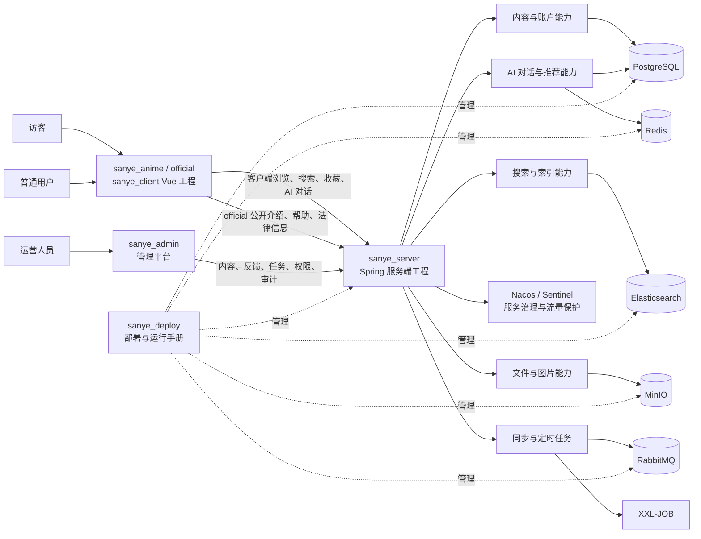
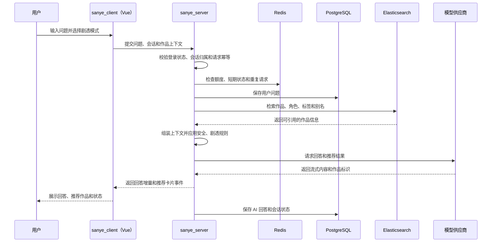
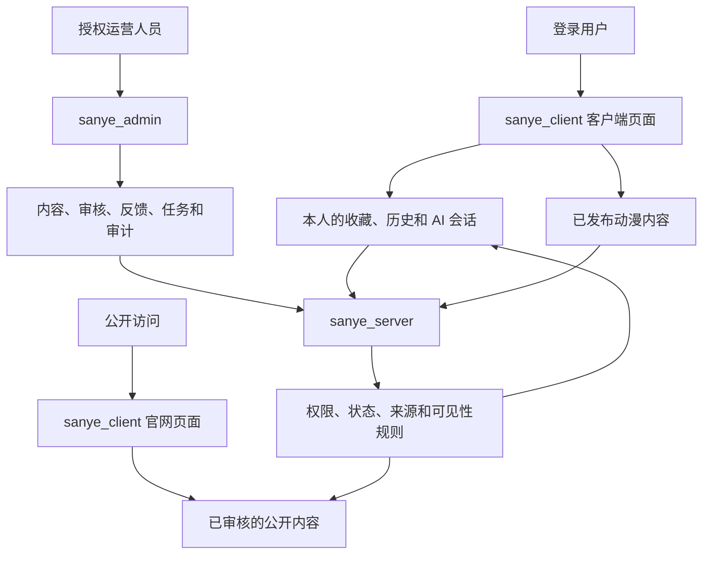

# sanye_anime 项目流程图

| 项目 | 内容 |
| --- | --- |
| 文档版本 | v0.10 |
| 文档状态 | 项目整体流程基线 |
| 适用范围 | `sanye_server`、`sanye_client`、`sanye_admin` 和 `sanye_deploy` |
| 更新时间 | 2026-09-10 |

本文档描述三个技术工程、产品端、业务服务、管理运营和单人开发发布之间的主要流程。图中的英文名称是项目目录、模块、分支或技术标识符，说明文字统一使用中文。

## 当前核对（2026-09-10）

当前流程已从页面/服务骨架推进至可靠事件、调度整合、独立恢复和配置防护；发布候选准备进行中。流程中的验收节点须绑定实际环境证据，当前完成范围见[任务清单](./development-tasks.md)和[审计](./current-status-audit.md)。

更新记录：2026-09-10，v0.10，按当前代码与进度校正本文事实或证据范围；依据上述源码、任务与审计引用。

## 1. 项目总体流程



总体关系可以概括为：三个核心工程按技术框架划分为 `sanye_server`（Spring）、`sanye_client`（Vue）和 `sanye_admin`（RuoYi）。其中 `sanye_client` 同时承载客户端和官网公开页面，`sanye_server` 提供 Spring 业务能力，`sanye_admin` 提供 RuoYi 运营治理，`sanye_deploy` 负责环境、启动、备份和发布操作。

## 2. 用户浏览与 AI 使用流程

```mermaid
flowchart TD
    start([用户打开 sanye_anime]) --> home["进入客户端首页"]
    home --> browse["浏览精选、新番、日漫、剧场版、榜单和排期"]
    browse --> choose{ "是否已找到目标作品？" }
    choose -->|是| detail["打开作品详情"]
    choose -->|否| search["使用全局搜索"]
    search --> result{ "是否有搜索结果？" }
    result -->|是| detail
    result -->|否| empty["展示无结果状态和 AI 找番入口"]
    empty --> aiEntry["进入 AI 页面"]
    detail --> action{ "下一步操作" }
    action -->|收藏| favorite["保存收藏"]
    action -->|查看信息| continue["继续浏览作品信息"]
    action -->|询问作品| aiEntry
    continue --> aiEntry
    favorite --> aiEntry
    aiEntry --> question["输入找番、剧情、角色或观看顺序问题"]
    question --> context["选择作品上下文和剧透模式"]
    context --> answer["接收 AI 流式回答"]
    answer --> recommendation["查看推荐作品卡片"]
    recommendation --> next{ "用户的后续动作" }
    next -->|打开推荐作品| detail
    next -->|继续追问| question
    next -->|保存会话| history["保存到 AI 历史"]
    next -->|结束| end([完成本次使用])
    history --> end
```

## 3. 内容创建、审核与发布流程

```mermaid
flowchart LR
    editor["内容运营"] --> draft["创建或编辑草稿"]
    draft --> source["补充数据来源、图片来源和变更原因"]
    source --> submit["提交审核"]
    submit --> review["内容审核"]
    review --> decision{ "审核结果" }
    decision -->|退回修改| draft
    decision -->|通过| approved["审核通过"]
    approved --> publish["发布内容"]
    publish --> index["更新搜索索引"]
    publish --> invalidate["失效或刷新缓存"]
    publish --> clientView["sanye_client 展示已发布内容"]
    publish --> websiteView["official 展示允许公开的内容"]
    clientView --> feedback["用户反馈或发现问题"]
    websiteView --> feedback
    feedback --> operator["运营人员处理"]
    operator --> change{ "是否需要修改或下架？" }
    change -->|修改| draft
    change -->|下架| unpublish["下架内容"]
    unpublish --> index
    unpublish --> invalidate
    unpublish --> archive["保留历史版本和审计记录"]
```

发布规则：只有审核通过并处于已发布状态的内容，才能进入客户端或官网的公开展示链路；AI 推荐也只能引用当前用户可见的已发布作品。

## 4. AI 提问与推荐流程



异常分支：额度不足时引导登录或等待额度恢复；模型超时、网络中断或服务不可用时保留用户问题并提供重试；作品检索不可用时不得把未经确认的模型猜测展示为确定事实。

## 5. 单人开发与发布流程

开发流程分为“正式编码前置门禁”和“实现与发布”两段。前置门禁用于保证原型、产品范围、产品文档和技术设计形成闭环；只有门禁通过，才允许为新业务功能创建 `feature/<task>` 分支。

```mermaid
flowchart TD
    prototype["完整评审客户端与官网原型"] --> states["补齐页面状态"]
    states --> mvp["冻结 MVP 范围"]
    mvp --> adminPrototype["完成管理平台原型"]
    adminPrototype --> productDocs["固化 product 产品文档"]
    productDocs --> technicalDesign["完成 docs 技术设计"]
    technicalDesign --> tasks["拆分开发任务并估时"]
    tasks --> gate{ "前置门禁是否全部通过？" }
    gate -->|否| prototypeFix["返回对应原型或文档任务修正"]
    prototypeFix --> gate
    gate -->|是| feature["创建 feature/<task> 分支"]
    feature --> local["本地开发与自测"]
    local --> check["类型检查、构建、单元测试、依赖和密钥扫描"]
    check --> pass{ "检查是否通过？" }
    pass -->|否| local
    pass -->|是| dev["合并到 dev"]
    dev --> devEnv["开发环境验证"]
    devEnv --> test["合并到 test"]
    test --> testEnv["测试环境验收与回归"]
    testEnv --> accept{ "是否达到发布条件？" }
    accept -->|否| fix["记录问题并回到 feature/<task>"]
    fix --> feature
    accept -->|是| release["合并到 release"]
    release --> backup["执行备份和发布前检查"]
    backup --> gray["小范围灰度发布"]
    gray --> observe["观察错误率、AI 成本、队列和数据写入"]
    observe --> stable{ "运行是否稳定？" }
    stable -->|否| rollback["执行回滚或降级"]
    stable -->|是| publish["扩大使用范围并记录发布结果"]
    rollback --> review["复盘并创建修复任务"]
    publish --> review
```

当前已进入正式业务代码开发：前置门禁 PRE-TODO-001 至 PRE-TODO-008 和 T-B-02 自动检查门禁已关闭，当前推进外部环境、发布验收与代码质量收口。任务分支命名暂用 `feature-<task>`（见 D-023），`feature` 分支归档后恢复 `feature/<task>`。

### 5.1 分支职责

| 分支 | 职责 | 允许进入的内容 |
| --- | --- | --- |
| `feature/<task>` | 单项功能开发和修复 | 当前任务范围内的代码、测试和文档 |
| `dev` | 日常集成 | 已完成本地检查的功能 |
| `test` | 测试与验收 | 已在 `dev` 验证的可测试版本 |
| `release` | 稳定发布基线 | 已完成验收、备份和回滚验证的版本 |

### 5.2 发布前检查顺序

1. 确认产品需求、技术决策和变更记录已经同步。
2. 执行 `sanye_client` 和 `sanye_admin` 的类型检查和构建，并执行 `sanye_server` 的 Maven 编译、测试和打包。
3. 执行服务端测试、依赖扫描和密钥扫描。
4. 验证内容、账号、AI、文件、任务和权限主流程。
5. 验证备份、恢复、回滚和已知问题记录。
6. 在 `test` 完成验收后再进入 `release`。

## 6. 产品端边界与数据流向



三个产品入口共享业务规则，但技术工程只有三个：`official` 和 `sanye_anime` 同属 `sanye_client`，`sanye_admin` 面向内部授权操作，`sanye_server` 提供统一服务能力。
