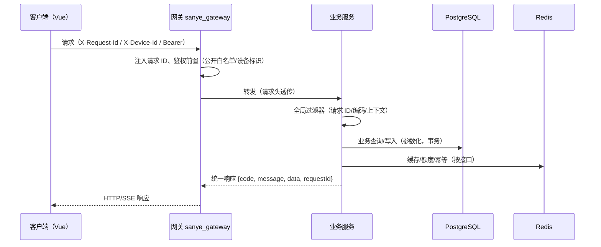
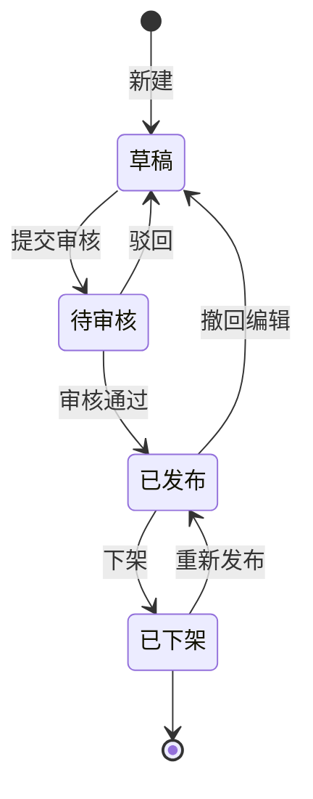
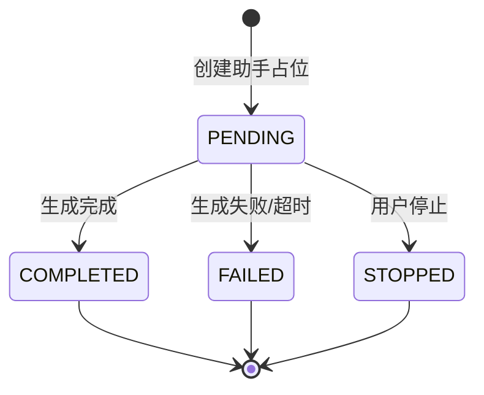
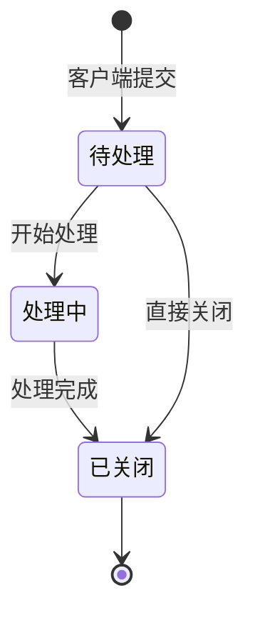
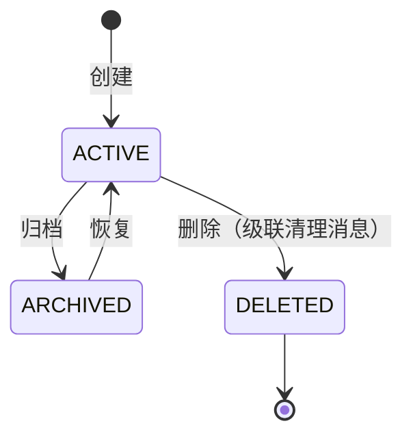
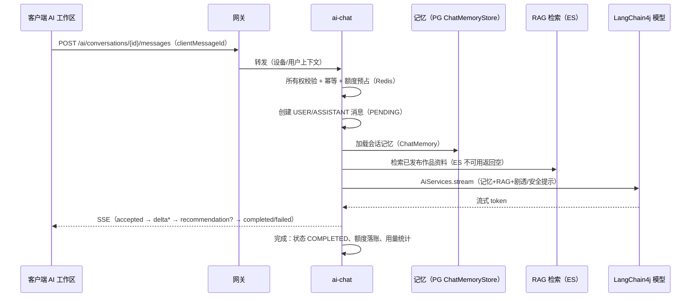

# sanye_anime 详细技术设计（实现级）

| 项目 | 内容 |
| --- | --- |
| 文档版本 | v0.7 |
| 文档状态 | 已完成自评审；TD-01 至 TD-16 为后续业务/环境决策清单 |
| 关联任务 | PRE-TODO-006（开始技术设计） |
| 关联文档 | [技术架构](./technical-architecture.md)、[版本基线](./version-baseline.md)、[决策记录](./decision-log.md)、[开发计划](./development-plan.md)、[后端 MVP 说明](./backend-mvp.md)、[MVP 冻结清单](../product/mvp-freeze.md)、[页面状态矩阵](../product/page-state-matrix.md) |
| 更新时间 | 2026-09-10 |

本文档是 [技术架构](./technical-architecture.md) 的实现级细化：技术架构确定“用什么、边界在哪”，本文档确定“每一步怎么实现”，覆盖数据模型、接口契约、模块实现、安全、并发、分布式、缓存安全、异常降级、测试和部署。凡与本文档冲突的实现，以本文档为准并回填架构文档。

## 当前核对（2026-09-10）

设计能力的实际验收范围见[当前审计](./current-status-audit.md)。事件、重建与迁移当前以[接口契约](./api-contract.md)、[数据设计](./database-design.md)和 T-R-02/03 为准；两库/对象恢复以 T-R-04 为准；配置缺失启动拒绝已在 T-R-05 实现。设计中的性能目标和生产拓扑不是运行验收结果。

更新记录：2026-09-10，v0.7，按当前代码与进度校正本文事实或证据范围；依据上述源码、任务与审计引用。

## 1. 设计输入与范围

### 1.1 设计输入

- 冻结产品范围：[MVP 冻结清单](../product/mvp-freeze.md) 的 C-P0-01 至 C-P0-09、O-P0-01 至 O-P0-05、A-P0-01 至 A-P0-07。
- 页面与状态：[页面状态矩阵](../product/page-state-matrix.md)（含 AI 回答过程状态机）。
- 架构与技术基线：[技术架构](./technical-architecture.md)、[版本基线](./version-baseline.md)。
- 已冻结决策：D-001 至 D-019。

### 1.2 设计范围

- 后端微服务（`sanye_gateway` + `sanye_auth`、`sanye_anime`、`sanye_search`、`sanye_ai_chat`、`sanye_favorite`、`sanye_file`、`sanye_feedback`、`sanye_job`）全部 P0 功能，见 [技术架构](./technical-architecture.md) 第 3 节。
- 管理平台 `sanye_admin_server` 与业务后端的受控协作边界。
- 基础设施：PostgreSQL 16、Redis 7.4、Elasticsearch 8.17、RabbitMQ 4.1、MinIO、Nacos 3.0.3、Sentinel 1.8.8、XXL-JOB 3.1.0。
- 不含桌宠（P1 增量）、Electron、微服务拆分和向量检索（P1/P2）。

### 1.3 P0 功能技术归属总表

| P0 功能 | 实现章节 | 主要技术归属 |
| --- | --- | --- |
| C-P0-01 主窗口与壳层 | 第 6.1 节 | 客户端路由与状态；服务端 `sanye_auth` |
| C-P0-02 首页 | 第 6.2 节 | `sanye_anime` + Redis 聚合缓存 |
| C-P0-03 搜索结果页 | 第 6.3 节 | `sanye_search` + Elasticsearch |
| C-P0-04 番剧仓库 | 第 6.4 节 | `sanye_anime` + PostgreSQL 筛选 |
| C-P0-05 作品详情 | 第 6.5 节 | `sanye_anime` + Redis 详情缓存 |
| C-P0-06 AI 工作区 | 第 6.6 节 | `sanye_ai_chat` + LangChain4j（模型/记忆/RAG）+ SSE + Redis + ES |
| C-P0-07 详情进入 AI 并返回 | 第 6.6、6.5 节 | 前端路由 + 会话上下文 |
| C-P0-08 登录引导、收藏、我的 | 第 6.1、6.7 节 | `sanye_auth`、`sanye_favorite` |
| C-P0-09 页面状态全覆盖 | 第 10 节 | 全模块统一状态与错误码 |
| O-P0-01 至 O-P0-05 官网 | 第 6.8 节 | `sanye_anime` 公开接口 + 静态页面 |
| A-P0-01 至 A-P0-07 管理平台 | 第 6.9 节 | RuoYi + 受控业务接口 |

## 2. 总体实现架构

### 2.1 应用形态（微服务）

- 后端为 Maven 多模块工程：父工程 `sanye_server`（聚合 + 依赖管理），子模块即独立 Spring Boot 服务：`sanye-server-core`（共享库）、`sanye-server-gateway`、`sanye-server-auth`、`sanye-server-anime`、`sanye-server-search`、`sanye-server-ai-chat`、`sanye-server-favorite`、`sanye-server-file`、`sanye-server-feedback`、`sanye-server-job`；每个服务独立 `main` 类、`application.yml`、端口与容器。
- 每个服务内部保持分层：`controller` → `service` → `repository`，`domain/model` 只放数据对象，不允许反向依赖。
- 服务间通信规则：同步调用走 OpenFeign（经网关或直连注册中心），异步协作走 RabbitMQ 事件；禁止跨服务直连数据库或直接操作对方 Repository。
- 服务间调用必须携带 requestId、调用方服务标识与用户上下文（转发头），并配置超时、重试与 Sentinel 熔断降级（见 8.1）。
- 数据边界：单 PostgreSQL 实例，每服务独立 schema（如 `sanye_auth`、`sanye_anime`），schema 间禁止 SQL 级联访问。
- 事务边界：`@Transactional` 只标注在服务内 Service 方法上，禁止跨服务事务；跨服务一致性走 Outbox + 事件 + 对账。

### 2.2 请求处理链路（每个接口通用）

```text
客户端请求
  -> sanye_gateway：路由、鉴权前置、跨域、限流、请求 ID
  -> 业务服务全局过滤器：请求 ID、字符编码、XSS 清理
  -> 业务服务鉴权过滤器：透传用户上下文（AuthContext）
  -> 统一异常处理：错误码 -> 结构化响应
  -> 限流/幂等切面（按接口标注）
  -> Controller 参数校验（Bean Validation）
  -> Service 业务逻辑（本地事务）
  -> Repository（MyBatis-Plus / Redis / ES）
  -> 统一响应包装 + 审计日志（异步）
```

#### 2.2.1 请求链路时序图



故障语义：上游不可用/连接拒绝 → 网关返回 503 + `{code:5002, requestId}`；
无路由 → 404 + 2003；SSE 流已提交不改写（见网关错误过滤器）。

#### 2.2.2 核心状态机

**内容状态（sanye_anime.status）**



公开可见性：仅“已发布”出现在列表/详情/排期；下架即时生效（PG 状态列，公开查询过滤）。

**AI 消息状态（sanye_conversation_message.status）**



状态推进由 AnswerStreamer 统一写入（appendDelta → complete/fail/stop），幂等重放不改变已终态消息。

**反馈状态（sanye_feedback.status）**



状态流转记录写入 sanye_feedback_handle_log（操作人/动作/备注），管理端接口按权限放行。

**会话状态（sanye_conversation.status）**



### 2.3 用户上下文（AuthContext）

- 定义 `AuthContext`（ThreadLocal），包含 `userId`、`roleIds`、`deviceId`、`sessionId`、`isAnonymous`。
- 所有接口通过 `AuthContext.requireUser()` 获取当前用户，禁止从请求参数信任 `userId`。
- 匿名用户使用 `deviceId`（由客户端生成 UUID 并持久化在 localStorage，服务端只做短期额度键，不作为账户标识）。
- 每个请求结束由过滤器清理 ThreadLocal，防止线程池串号。

### 2.4 统一响应与错误码

- 成功响应：`{ "code": 0, "message": "ok", "data": {...}, "requestId": "..." }`。
- 错误码分段：`1xxx` 客户端参数、`2xxx` 认证授权、`3xxx` 业务规则、`4xxx` 外部依赖、`5xxx` 服务内部。

| 错误码 | 含义 | 客户端表现 |
| --- | --- | --- |
| `1001` | 参数校验失败 | 表单错误提示 |
| `1002` | 请求过于频繁 | 限流提示，不弹窗刷屏 |
| `2001` | 未登录/凭证过期 | 登录引导，保留现场 |
| `2002` | 无权限 | 权限不足提示 |
| `2003` | 资源不存在或不可见 | 不泄露存在性 |
| `3001` | 业务状态不允许 | 按状态矩阵展示 |
| `3002` | 额度用尽 | 额度提示 + 恢复时间 |
| `4001` | AI 供应商超时 | 失败重试，保留问题 |
| `4002` | ES 不可用 | 搜索暂不可用 |
| `5001` | 服务内部错误 | 通用错误页 |

## 3. 数据模型设计

所有表名使用 `sanye_` 前缀；主键统一 `BIGINT` 雪花 ID；核心表必须包含 `created_at`、`updated_at`；删除策略：用户私有数据逻辑删除（`deleted_at`），任务/事件表物理清理。迁移使用 Flyway（`V1__init.sql` 等），禁止手改生产表。

迁移落地：Flyway 已接入 8 个业务服务（`flyway-core`、`flyway-database-postgresql`、PostgreSQL 驱动、`spring.flyway` 配置与各服务 `V1__init.sql`），每个服务维护自己的 schema；空库/重复执行及升级证据见 T-R-01/02，独立恢复中的 Flyway 校验见 T-R-04；目标数据库仍须逐环境验证。

### 3.1 用户与认证

```sql
create table sanye_user_account (
  id            bigint primary key,
  username      varchar(64) not null unique,
  password_hash varchar(100) not null,          -- BCrypt
  nickname      varchar(50),
  status        varchar(16) not null default 'ACTIVE', -- ACTIVE/DISABLED
  created_at    timestamptz not null default now(),
  updated_at    timestamptz not null default now(),
  deleted_at    timestamptz
);

create table sanye_user_auth (
  id               bigint primary key,
  user_id          bigint not null references sanye_user_account(id),
  auth_type        varchar(16) not null,        -- CAS（业务端不保存密码）
  cas_user_id      varchar(128),                -- CAS 主体标识（用户名/邮箱）
  credential       varchar(100),                -- 预留其他认证方式
  refresh_token_id varchar(64),                 -- 当前有效 refresh 凭证
  created_at       timestamptz not null default now(),
  unique (auth_type, cas_user_id)               -- 幂等：同一 CAS 主体只绑定一个账号
);
```

- 密码只存 BCrypt 哈希（仅本地备用登录方式使用，CAS 主流程不保存密码）；登录失败返回统一提示，不区分账号不存在。
- 刷新凭证采用“轮换 + 复用检测”：每次刷新签发新 refresh token，旧 token 立即失效；检测到旧 token 复用则吊销整个会话族并告警（见 6.1.3）。

### 3.2 动漫内容

```sql
create table sanye_anime (
  id              bigint primary key,
  title           varchar(120) not null,
  original_title  varchar(120),
  type            varchar(20)  not null,        -- ORIGINAL/TV/MOVIE/WEB
  year            int,
  summary         text,
  cover_file_id   bigint,                        -- 关联 sanye_file_object
  status          varchar(16) not null default 'DRAFT', -- DRAFT/REVIEW/PUBLISHED/UNPUBLISHED
  source          varchar(255),                  -- 数据来源与授权说明
  license_note    varchar(500),                  -- 版权与有效期备注
  version         bigint not null default 0,     -- 乐观锁
  published_at    timestamptz,
  created_at      timestamptz not null default now(),
  updated_at      timestamptz not null default now(),
  deleted_at      timestamptz
);
create index idx_sanye_anime_status on sanye_anime (status, published_at desc);

create table sanye_anime_alias (
  id         bigint primary key,
  anime_id   bigint not null references sanye_anime(id),
  alias      varchar(120) not null,
  unique (anime_id, alias)
);

create table sanye_anime_tag (
  anime_id bigint not null,
  tag      varchar(32) not null,
  primary key (anime_id, tag)
);

create table sanye_anime_schedule (
  id           bigint primary key,
  anime_id     bigint not null references sanye_anime(id),
  episode_no   int not null,
  air_date     date not null,
  air_time     time,
  status       varchar(16) not null default 'PLANNED', -- PLANNED/AIRED/CANCELLED/TBD
  external_id  varchar(64),                      -- 来源稳定 ID，幂等键
  unique (anime_id, episode_no),
  unique (external_id) where external_id is not null
);

create table sanye_anime_banner (
  id         bigint primary key,
  anime_id   bigint not null,
  position   int not null,
  status     varchar(16) not null default 'DRAFT',
  start_at   timestamptz,
  end_at     timestamptz
);
```

- 状态机：`DRAFT -> REVIEW -> PUBLISHED -> UNPUBLISHED -> REVIEW`；只有 `PUBLISHED` 进入公开接口。
- 状态变更通过 `sanye_anime_status_log` 记录操作人、原因、旧值、新值、requestId。
- 并发保护：`UPDATE sanye_anime SET status=?, version=version+1 WHERE id=? AND version=?`（MyBatis-Plus 乐观锁插件）。

### 3.3 收藏与历史

```sql
create table sanye_user_favorite (
  user_id  bigint not null,
  anime_id bigint not null,
  created_at timestamptz not null default now(),
  primary key (user_id, anime_id)               -- 唯一约束防重复收藏
);

create table sanye_user_watch_history (
  id         bigint primary key,
  user_id    bigint not null,
  anime_id   bigint not null,
  last_view_at timestamptz not null default now(),
  unique (user_id, anime_id)                    -- 每部作品只保留一条最近记录
);
```

- 收藏使用复合主键保证“重复点击不产生重复记录”；前端仍做按钮防抖。
- 浏览记录按 `user_id + anime_id` 唯一，更新 `last_view_at` 而不是无限插入。

### 3.4 AI 会话与消息

```sql
create table sanye_conversation (
  id          bigint primary key,
  user_id     bigint not null,
  title       varchar(50),
  status      varchar(16) not null default 'ACTIVE', -- ACTIVE/ARCHIVED/DELETED
  context_anime_id bigint,                       -- 当前作品上下文
  spoiler_mode varchar(8) not null default 'SAFE',
  created_at  timestamptz not null default now(),
  updated_at  timestamptz not null default now()
);
create index idx_sanye_conversation_user on sanye_conversation (user_id, updated_at desc);

create table sanye_conversation_message (
  id                bigint primary key,
  conversation_id   bigint not null references sanye_conversation(id),
  client_message_id varchar(64) not null,         -- 客户端生成幂等键
  role              varchar(8) not null,          -- USER/ASSISTANT/SYSTEM
  content           text not null,
  status            varchar(16) not null default 'PENDING', -- PENDING/COMPLETED/FAILED/STOPPED
  model             varchar(64),
  generate_try      int not null default 1,
  created_at        timestamptz not null default now(),
  unique (conversation_id, client_message_id)      -- 幂等唯一约束
);
create index idx_sanye_message_conv on sanye_conversation_message (conversation_id, id);

create table sanye_ai_quota_log (
  id           bigint primary key,
  user_id      bigint,
  device_id    varchar(64),
  quota_date   date not null,
  action       varchar(16) not null,              -- CONSUME/REFUND
  amount       int not null,
  request_id   varchar(64) not null,
  unique (request_id)                             -- 同一请求只扣一次
);

create table sanye_ai_usage (
  id            bigint primary key,
  message_id    bigint not null,
  model         varchar(64),
  prompt_tokens int,
  completion_tokens int,
  latency_ms    int,
  cost_cents    int,
  created_at    timestamptz not null default now()
);
```

### 3.5 反馈与文件

```sql
create table sanye_feedback (
  id           bigint primary key,
  user_id      bigint,
  type         varchar(20) not null,              -- CONTENT_ISSUE/AI_ISSUE/SUGGESTION/OTHER
  content      text not null,
  ref_type     varchar(20),                       -- ANIME/CHAT
  ref_id       bigint,
  status       varchar(16) not null default 'OPEN', -- OPEN/PROCESSING/CLOSED
  priority     varchar(8)  not null default 'NORMAL',
  closed_at    timestamptz,
  created_at   timestamptz not null default now()
);

create table sanye_feedback_handle_log (
  id           bigint primary key,
  feedback_id  bigint not null,
  operator_id  bigint,
  action       varchar(32) not null,
  note         varchar(500),
  created_at   timestamptz not null default now()
);

create table sanye_file_object (
  id            bigint primary key,
  bucket        varchar(64) not null,
  object_key    varchar(255) not null unique,
  original_name varchar(255),
  content_type  varchar(100),
  size_bytes    bigint,
  sha256        varchar(64),
  scan_status   varchar(16) not null default 'PENDING', -- PENDING/CLEAN/INFECTED
  owner_user_id bigint,
  status        varchar(16) not null default 'ACTIVE',
  created_at    timestamptz not null default now(),
  unique (bucket, object_key)
);
```

### 3.6 可靠事件（Outbox）

```sql
create table sanye_event_outbox (
  id            bigint primary key,
  event_id      varchar(64) not null unique,
  event_type    varchar(64) not null,             -- anime.published / anime.updated ...
  aggregate_id  bigint not null,
  payload       jsonb not null,
  status        varchar(16) not null default 'PENDING', -- PENDING/PUBLISHED/FAILED
  retry_count   int not null default 0,
  next_retry_at timestamptz,
  created_at    timestamptz not null default now(),
  published_at  timestamptz
);
create index idx_sanye_outbox_pending on sanye_event_outbox (status, next_retry_at);
```

## 4. 通用横切实现

### 4.1 请求 ID 与日志

- 过滤器读取 `X-Request-Id`，缺失则生成 UUID，写入 MDC；响应头回写同一值。
- 访问日志记录：requestId、路径、用户 ID（脱敏）、耗时、错误码。禁止记录密码、token、完整问题正文和模型密钥。
- 日志脱敏工具统一处理手机号、邮箱、身份证、token 片段。

### 4.2 幂等切面

- 注解 `@Idempotent(key = "#req.clientMessageId", ttl = 600)`。
- 实现：Redis `SET ai:idempotency:{key} 1 NX EX 600`；已存在则返回首次结果或 `1002`，由业务选择。
- 对数据库有唯一约束的场景（如消息），以唯一约束为最终防线，Redis 只做前置拦截。

### 4.3 审计

- 写操作切面记录：操作人、模块、动作、目标 ID、变更摘要、requestId、时间。
- 管理平台操作必须落 `sys_oper_log`（RuoYi 已有）；业务端用户敏感操作（注销、导出、删除会话）落 `sanye_audit_log`。

## 5. 分模块实现设计（P0）

### 5.1 认证与账户（C-P0-01、C-P0-08、A-P0-01）

#### 5.1.1 登录（CAS 流程）

认证方案：使用 CAS（Apereo CAS，CAS 协议 v3 `serviceValidate`）统一单点登录。CAS 只负责“证明你是谁”；应用侧在 ticket 校验通过后签发自有本地会话凭证，后续 API 访问全部走本地 token。

1. 前端访问需要登录的页面 → 后端返回 `2001` → 前端跳转 `https://{cas-server}/cas/login?service={应用回调地址}`。
2. CAS 服务器完成认证后重定向回 `service` 并携带 `ticket`。
3. 后端 `/api/v1/auth/cas/callback?ticket=...` 接收 ticket。
4. 后端必须服务端调用 `https://{cas-server}/cas/serviceValidate?service={与发起时完全一致的地址}&ticket={ticket}` 校验 ticket；禁止信任客户端直接传来的断言。
5. 校验通过后解析 CAS 主体（用户名/邮箱），按账号映射规则查找或创建 `sanye_user_account`（见 5.1.5）。
6. 签发本地 access/refresh token（见 5.1.3），写 `sanye_user_auth.refresh_token_id`，返回前端。
7. 前端保存本地 token，后续 API 全部走 token；不再与 CAS 交互，直到本地会话过期。
8. 回调接口幂等：同一 ticket 只允许成功一次（CAS 侧单次使用 + 本地 `auth:cas-ticket:{ticket}` 短缓存防重放），重复回调返回原会话或重新登录引导。

#### 5.1.2 退出与单点登出（SLO）

- 本地退出：删除当前 refresh token、access token 加入短期黑名单，然后跳转 `https://{cas-server}/cas/logout?service={应用登录页}` 触发全局登出。
- CAS 单点登出回调：CAS 通过 SLO endpoint 通知应用时，应用吊销对应用户全部本地会话（删除该用户 refresh 键 + 递增 `auth:session:revoke:{userId}` 版本号）。
- 修改密码（由 CAS 侧处理）、注销账号时同样吊销该用户全部会话。

#### 5.1.3 本地会话凭证（CAS 之后的 API 凭证）

- Access token：JWT（HS256，密钥 64 字节以上，环境变量注入），有效期 30 分钟，只携带 `userId`、`sessionVersion`，不携带敏感字段。
- Refresh token：随机 256 位字符串，Redis `auth:refresh:{id}` -> `{userId, sessionVersion, familyId}`，有效期 7 天，轮换签发；检测旧 token 复用即吊销会话族。
- 鉴权过滤器：解析 JWT → 校验 `sessionVersion` 与 Redis 吊销版本一致 → 写入 AuthContext；刷新接口只认 refresh token。
- 为什么不直接依赖 CAS TGT：TGT 是 CAS 的浏览器 Cookie，业务 API 无法安全地逐请求校验；本地 token 负责 API 鉴权与即时吊销，CAS 只承担登录入口。

#### 5.1.4 CAS 集成要点与账号映射

- service 地址校验：回调校验时 `service` 必须与后端配置的固定白名单精确匹配，防止 ticket 被重放到其他 service。
- 协议：CAS v3 `/serviceValidate`；解析 XML 中的用户 principal，字段映射（用户名/邮箱）由配置决定。
- 账号映射（默认建议）：CAS 主体 → 查 `sanye_user_auth(auth_type='CAS', cas_user_id=主体)`；不存在则自动创建用户并绑定，首次登录返回“新账号”标记，前端可引导补充昵称。是否要求审批待评审（TD-12）。
- 匿名用户：未登录继续用 `deviceId` 体验有限 AI 额度；CAS 登录后按账号额度。
- 管理平台：首版保留 RuoYi 内部账号体系，是否接入 CAS 待评审（TD-11）。
- 兼容性：CAS Client（Apereo Java CAS Client 或 Spring Security CAS 兼容层）与 Spring Boot 3.5 / JDK 21 需要验证，列入版本基线 review 项。

#### 5.1.5 权限（RBAC）

- 管理端沿用 RuoYi 角色/菜单/按钮权限；业务端定义最小代码角色集合：`USER`、`ADMIN`、`CONTENT_EDITOR`、`CONTENT_REVIEWER`、`AUDITOR`。代码角色与产品角色名称（超级管理员、内容编辑、内容审核员、AI 运营、客服运营、数据运营、审计员，见 [产品总体架构](../product/overall-architecture.md) 5.2）建立映射，管理端按产品角色授权。
- 接口权限使用注解 `@RequireRole(...)`；数据权限（如“只能处理分配给我的反馈”）在 Service 内校验，禁止只靠前端隐藏按钮。
- 资源所有权校验统一模式：任何 `{resourceId}` 操作先 `SELECT ... WHERE id=? AND user_id=?` 或先查再比对，返回 `2003` 不区分“不存在”与“无权限”。

### 5.2 首页与内容聚合（C-P0-02）

#### 5.2.1 接口

`GET /api/v1/home?tab=FEATURED|JV|MOVIE` 返回 Banner、快捷入口、内容分区（每个分区为作品 ID 列表 + 卡片元数据）。

#### 5.2.2 实现步骤

1. Controller 只做参数校验和权限读取。
2. Service 先查 Redis `anime:home:{tab}:{version}`；命中直接返回。
3. 未命中：单次 SQL 批量查询（Banner 按 position 排序；分区按运营配置取 ID 集合，再 `WHERE id IN (...)` 一次取卡片），避免 N+1。
4. 组装后写缓存：`SET ... EX 120 JITTER(±20)`，同时写空值缓存（`EMPTY`，EX 60）防穿透。
5. 返回后异步记录曝光事件（仅统计，不阻塞）。

#### 5.2.3 缓存失效

- 内容发布/更新/下架时，事务提交后写 `sanye_event_outbox`，事件消费者删除对应 `anime:home:*` 与 `anime:detail:{id}`。
- 删除缓存采用“延迟双删”：更新 DB 前删一次，事务提交后延迟 500ms 再删一次（防并发读回旧值写回）。首版接受该方案，配合版本号键兜底（见第 8 节）。

### 5.3 搜索（C-P0-03）

#### 5.3.1 索引

```jsonc
// anime_search_v1
{
  "mappings": {
    "properties": {
      "animeId": { "type": "long" },
      "title": { "type": "text", "analyzer": "ik_max_word" },
      "aliases": { "type": "text", "analyzer": "ik_max_word" },
      "tags": { "type": "keyword" },
      "status": { "type": "keyword" },          // 只索引 PUBLISHED
      "score": { "type": "float" }
    }
  }
}
```

#### 5.3.2 写入与同步

- 全量：XXL-JOB `rebuildAnimeIndex` 调用受控搜索接口，写入 `<ES_INDEX>_<UUID>` 物理索引；分页总数、作品唯一性、公开状态、批量写入结果和刷新后的数量全部通过后，原子切换 `ES_INDEX` 别名。默认别名 `sanye_anime_live`，旧索引及失败候选保留供排查，不自动删除。
- 增量：消费 `anime.published` / `anime.updated` 事件，按 `animeId` upsert；下架消费 `anime.unpublished` 删除文档。
- 写入失败：事件进死信并告警；由对账任务每小时比对 DB 已发布集合与索引数量。

#### 5.3.3 查询

- `GET /api/v1/search?keyword=&type=&status=&year=&page=&size=`。
- ES 查询 title/aliases/tags，过滤 `status=PUBLISHED`，返回 `animeId` 与高亮片段；分页用 `search_after`，禁止大 from 深分页。
- 热门关键词结果缓存 `search:hot:{keyword}:{page}` EX 60；普通结果不缓存或仅缓存首页。
- ES 不可用：返回 `4002`，前端展示“搜索暂不可用”，不降级到 PostgreSQL 模糊查询（防慢查询与注入风险）。

### 5.4 番剧仓库与筛选（C-P0-04）

- `GET /api/v1/anime?keyword=&type=&status=&year=&page=&size=`。
- 只查 `status=PUBLISHED`；组合筛选全部走索引（`(status, published_at desc)`、`type`、`year`）；keyword 命中 title/alias 时通过 ES 或 `ILIKE` 二选一（首版：ES 已含仓库场景，直接用 ES 查询复用 5.3，避免两套搜索）。
- 分页上限 100；返回总数为 `count(*)` 或缓存计数，禁止每页扫描全表。

### 5.5 作品详情（C-P0-05、C-P0-07）

#### 5.5.1 接口与实现

- `GET /api/v1/anime/{id}`：先 `SELECT` 校验 `status=PUBLISHED`（或管理员可看非公开），再组装详情（作品、标签、角色、排期、相似作品）。
- 详情缓存 `anime:detail:{id}` EX 300，随更新事件失效；相似作品在缓存中保留 ID 列表，详情卡片按 ID 批量查询。
- 收藏状态：登录用户额外返回 `isFavorite`（读取内存态或批量查 `sanye_user_favorite`），缓存中不混入用户态数据。

#### 5.5.2 下架可见性

- 下架后：公开详情接口返回 `2003`；客户端已缓存的详情在下次请求时刷新失败并展示“作品已下架”状态（状态矩阵要求）。
- ES 同步删除文档；首页/榜单缓存按事件失效。

### 5.6 AI 对话（C-P0-06，全项目最复杂模块）

#### 5.6.1 发送消息完整流程（含并发与幂等）

```text
1. 客户端生成 clientMessageId，POST /api/v1/ai/conversations/{id}/messages
2. 鉴权：conversation.user_id == AuthContext.userId，否则 2003
3. 幂等前置：Redis SET ai:idempotency:{clientMessageId} NX EX 600
   - 已存在 -> 查询原消息状态返回，不重复调用模型、不重复扣额度
4. 额度检查（原子）：Lua 脚本（见 6.2）
5. 事务：INSERT sanye_conversation_message (role=USER, status=PENDING)
   - 唯一约束 (conversation_id, client_message_id) 兜底并发重复
6. 提交后：通过 LangChain4j 组装上下文（ChatMemory 会话记忆 + ContentRetriever RAG 检索 + 当前作品字段 + 剧透/安全系统提示），见 5.6.6
7. 串行生成控制：每会话分布式锁 ai:conversation:gen:{id}（见 7.3），
   防止同一会话并发两条生成互相覆盖
8. 通过 LangChain4j `StreamingChatLanguageModel` 调用模型（流式），SSE 返回事件：
   message.accepted -> message.delta* -> recommendation? -> message.completed|failed
9. 生成完成事务：更新消息 status=COMPLETED、写 sanye_ai_usage、扣额度落账 sanye_ai_quota_log（request_id 唯一）
10. 异步：发 ai.message.completed 事件（用量/质量统计）
```

- 生成任务提交到 `aiGenerateExecutor` 线程池执行；消息落库与模型生成在时序上分离，模型流式调用期间不持有数据库连接（见 7.8、7.9）。

#### 5.6.1a AI 对话主链路时序图



关键约束：拒答预检先于模型调用；SAFE 完成时二次校验并替换泄露；同一会话生成串行
（分布式锁），停止/重生成不新增用户消息。

#### 5.6.2 额度扣减原子实现（Redis Lua）

```lua
-- KEYS[1]=ai:quota:user:{id}:{date}  KEYS[2]=ai:quota:anon:{device}:{date}
-- ARGV[1]=limit  ARGV[2]=1
local key = KEYS[1]
local limit = tonumber(ARGV[1])
local cur = tonumber(redis.call('GET', key) or '0')
if cur >= limit then return -1 end
redis.call('SET', key, cur + 1, 'EX', 86400)
return cur + 1
```

- 扣减只在生成“接受并进入生成”时预占、完成时落账；失败/停止退回预占（`ai:quota:*:pending` 计数或落账 REFUND 记录，request_id 唯一防重复退）。
- 对账任务每日核对 Redis 计数与 `sanye_ai_quota_log` 汇总，差异进入告警。

#### 5.6.3 停止与重试

- 停止：前端发送 `POST /ai/.../{messageId}/stop`；服务端标记生成任务取消令牌（内存 `ConcurrentHashMap<messageId, AtomicBoolean>` + Redis 短期键），SSE 通道收到取消后停止写入；消息 `status=STOPPED`。
- 重试：客户端携带原 `clientMessageId` + 新 `generateTry` 调用“重新生成”；服务端删除失败/停止消息的旧 assistant 记录（或新建 assistant 消息行），`generate_try+1`；幂等键按 `clientMessageId + generateTry` 区分。
- 断线：SSE 断开后服务端最多继续生成 60 秒，`message.completed` 落库；客户端重连后调用 `GET /ai/.../messages?after={lastId}` 补拉，不重复调用模型。

#### 5.6.4 上下文与剧透控制

- 上下文组装由 LangChain4j 在白名单内完成：ChatMemory 会话记忆 + RAG 检索结果（ContentRetriever） + 当前作品结构化字段（标题/简介/已看集数）+ 剧透模式。
- 剧透模式：`SAFE` 模式下系统提示注入“仅回答截至用户已看集数的内容，不得透露后续情节”；剧透规则作为受控 RAG 文档注入；输出审核规则对关键词/实体做二次校验（基础实现用规则表，P1 再接审核模型）。
- 提示词注入防护：系统提示与用户输入用分隔符隔离，并对“忽略以上指令”类关键词做输入标记；用户输入不直接拼接为可执行指令。
- 模型不返回播放/下载地址：输出后处理剥离 URL 白名单之外的链接。

#### 5.6.5 推荐卡片

- 模型返回结构化 JSON（含 `recommend: [{animeId, reason}]`）；服务端校验 `animeId` 存在且 `PUBLISHED`，过滤无效项；前端按卡片渲染。
- 推荐必须落 `sanye_conversation_message.recommend_json`，详情页跳转走作品 ID。

#### 5.6.6 LangChain4j 集成设计（模型、记忆、RAG）

- 依赖与版本：`langchain4j-spring-boot-starter` + 模型适配器（OpenAI 兼容端点）；版本与 Spring Boot 3.5 / JDK 21 / ES Java Client 的兼容性列入版本基线 review（TD-14）。
- 模型封装：
  - `ChatLanguageModel`（普通问答）+ `StreamingChatLanguageModel`（SSE 流式）。
  - 模型供应商统一走适配层，配置项（endpoint、key、model、temperature、maxTokens、timeout）从环境变量/Nacos 注入，Key 不进客户端与 Git。
- 记忆（Memory，必须使用）：
  - 每个会话一个 `ChatMemory`，自定义 `ChatMemoryStore` 持久化到 PostgreSQL，复用 `sanye_conversation_message`，不另建表。
  - 加载规则：按 `conversation_id` 读取最近消息（默认最近 10 条或 4k tokens，截断策略见 TD-16）；只取 USER/ASSISTANT 角色。
  - 写入规则：生成完成后把新消息写回 ChatMemoryStore，与消息表保持一致；记忆不跨会话；“清除上下文”= 重建空 ChatMemory，不删除历史消息。
- RAG（必须使用）：
  - `ContentRetriever` 实现：查询 Elasticsearch（BM25，title/aliases/tags/简介），只检索 `status=PUBLISHED` 内容，返回 top-k（默认 5）。
  - 检索内容与元数据（animeId、标题、类型、排期、剧透级别）注入提示词；推荐卡片只使用经服务端回源校验（animeId 存在且 PUBLISHED）的检索结果。
  - 安全与运营规则（剧透、拒答、输出白名单）也作为受控 RAG 文档注入，规则版本由管理端维护。
  - 检索失败降级：ES 不可用时普通问答可继续（无检索上下文），推荐卡片返回不可用；不允许把未经检索确认的内容当作事实。
  - Embedding/向量检索列为 P1 增强（TD-15），P0 使用经典 BM25 RAG，不引入向量数据库。
- AiServices：
  - 定义 `AiAssistant` 接口（`@SystemMessage` / `@UserMessage` / `@V` 参数），统一封装鉴权、额度、剧透与引用校验。
  - 输出解析：要求模型返回结构化 JSON（回答 + recommendations），服务端校验后落库并转 SSE 事件。
- 并发与资源：生成运行在 `aiGenerateExecutor`；模型调用在数据库事务外；流式停止通过流 token 取消（见 7.6）。

### 5.7 收藏、历史与我的（C-P0-08）

- 收藏：`PUT/DELETE /api/v1/users/me/favorites/{animeId}`；插入使用 `INSERT ... ON CONFLICT DO NOTHING`，删除使用物理删除；返回当前状态。
- 历史：详情页浏览事件写入 `sanye_user_watch_history`（异步、去重、失败不阻塞详情）。
- 我的：聚合收藏列表（分页）、最近历史、会话入口；未登录时返回 `2001` 引导登录，公开数据仍可浏览。

### 5.8 官网公开接口（O-P0-01 至 O-P0-05）

- 官网只调用公开接口：`GET /api/v1/public/home`（公开精选）、`GET /api/v1/public/legal`（文案占位）。
- 公开接口同样走鉴权过滤器但允许匿名；不暴露管理路由、内部 ID 序列和运营配置。
- 法律文案在 `sanye_admin` 配置表中维护，官网读取已发布版本；GAP-013 审查前保持占位。

### 5.9 管理平台协作（A-P0-01 至 A-P0-07）

- 管理端不直连业务库：通过 HTTP 调用业务端受控接口，鉴权使用 `X-Caller-Name` + `X-Internal-Token` 服务间凭证（环境变量注入，定期轮换）。
- 业务端管理接口统一 `@RequireRole({ADMIN, CONTENT_EDITOR, CONTENT_REVIEWER})` 并在方法内二次校验数据权限。
- 内容操作：管理端写 `sanye_admin` 自己的业务表（RuoYi 工程内）或调用业务端接口写入 `sanye_server` 库，两者必须二选一并记录；首版建议业务数据全部由 `sanye_server` 管理，RuoYi 只做展示与审批流，审批结果通过受控接口写入。
- 任务管理：管理端读取 XXL-JOB 执行记录，触发立即执行走 XXL-JOB OpenAPI；权限按角色（运维/超管）。
- 审计：RuoYi 自带操作日志 + 业务端审计日志，按 `requestId` 关联。

### 5.10 文件与任务（文件 P0、任务 P0）

- 上传：预签名或“POST 上传凭证 → 直传 MinIO → 回调确认”。服务端生成对象 Key：`user-assets/{userId}/{uuid}.{ext}`，禁止客户端指定 Key。
- 校验：扩展名白名单 + 服务端魔数校验（不信任 Content-Type）+ 大小限制（头像 ≤2MB，反馈附件 ≤10MB）+ 频率限制。
- 扫描：上传后 `scan_status=PENDING`，文件扫描任务（ClamAV 容器或等价能力，见待评审项）标记 CLEAN/INFECTED；INFECTED 不进入任何公开读取链路。
- 下载：私有对象返回 7 天有效签名 URL；读取前校验业务权限（本人头像/本人反馈附件）。

## 6. 安全设计（详细）

### 6.1 认证与凭证安全

- CAS 接入安全：ticket 必须由服务端向 CAS `/serviceValidate` 校验；`service` 地址精确白名单；ticket 单次使用 + 本地短缓存防重放；CAS 通信全程 HTTPS。
- SLO 回调安全：回调路径校验来源（共享密钥签名或内网白名单），回调只做“吊销会话”，不接受业务参数。
- 本地凭证安全：JWT 使用 HS256 + 64 字节密钥（环境变量注入，禁止进 Git/日志），后续多实例需要可平滑切换 RS256；refresh token 为 256 位随机值，Redis 存储，轮换签发，检测旧 token 复用即吊销会话族（防盗窃重放）。
- 密码策略（仅本地备用登录方式）：最少 8 位、必须含字母与数字；BCrypt cost=10；不允许明文日志；CAS 主流程不保存密码。
- 登录接口限流：CAS 回调与本地刷新接口均加账号维度 + IP 维度限流，防 ticket 重放探测和刷新接口爆破。

### 6.2 授权与越权防护

- 所有资源接口先鉴权再查数据；所有权校验统一模式（见 5.1.4）。
- 列表接口支持数据权限过滤（如反馈“只处理分配给我的”），在 SQL 层加条件，禁止在应用层过滤后仍返回全部。
- 管理端角色与普通用户角色严格分离：业务接口不信任管理端传来的 `userId`。
- 越权测试清单：跨用户访问会话/收藏/反馈、修改他人资料、访问他人文件、管理接口未授权调用、直接改 URL 的 ID。

### 6.3 Web 安全

- XSS：前端 Vue 默认转义；富文本/简介字段在服务端做白名单清洗（`HTMLFilter` 已在 RuoYi common 中）。
- SQL 注入：MyBatis 全部使用 `#{}` 参数绑定，禁止 `${}` 拼接动态表名/排序字段；排序字段走枚举映射。
- CSRF：无状态 JWT 场景下主要依赖 token 头，不做 Cookie 会话；如引入 Cookie 场景需 CSRF token。
- SSRF：外部内容源抓取只允许白名单域名 + IP 段校验 + 超时 + 重定向次数限制。
- 上传安全：魔数校验、大小限制、文件名重生成、存储与执行目录隔离（MinIO 对象不落地执行）。

### 6.4 数据与密钥安全

- 生产凭据（DB/Redis/RabbitMQ/MinIO/模型 Key）只通过环境变量或 Nacos 密文注入；仓库内一律占位符。
- 敏感字段：手机号、邮箱等 PII 入库前按需加密（AES-GCM，密钥经 KMS/环境变量），日志与缓存只存脱敏值。
- Redis 不缓存用户 PII；Key 只用内部 ID/脱敏值，禁止拼接手机号（见第 8 节）。
- 日志脱敏在序列化层统一执行（Logback 过滤器 + 自定义脱敏注解）。
- 数据删除：注销账号需确认，收藏/历史/会话按隐私规则删除或匿名化；删除操作写审计。

### 6.5 AI 安全

- 模型 Key 只存在服务端，客户端永不接触；模型调用统一走 `sanye_ai_chat` 内的 LangChain4j 模型适配层。
- 安全拒答：固定敏感场景规则表 + 输入/输出双层检测；剧透规则通过率按开发计划 AI 评测标准（≥95%）。
- 成本控制：额度上限（匿名 5/日、登录 30/日）+ 单日模型成本告警 + 模型超时/重试上限（3 次）。
- 输出过滤：剥离未授权 URL、脚本片段、HTML；结构化推荐必须过作品白名单。

### 6.6 管理端安全

- RuoYi 密码强度与登录失败锁定；Token 存 Redis，服务重启后仍可吊销。
- 管理操作全部记录操作日志（谁、何时、对什么、改了什么、requestId）。
- Sentinel 对管理写接口限流；Dashboard 不对公网开放。

### 6.7 安全验收清单（写代码前逐项核对）

- 密钥扫描（gitleaks）在 CI 中执行，历史提交也扫描。
- 依赖漏洞扫描（OWASP Dependency-Check / Trivy）纳入门禁。
- 至少一次外部渗透/自测覆盖：越权、爆破、注入、上传、SSRF、JWT 篡改、refresh 复用。

## 7. 并发设计（详细）

### 7.1 幂等

- 三层防线：Redis 幂等键（前置拦截）→ 数据库唯一约束（最终保障）→ 状态机校验（业务兜底）。
- 典型键：
  - 消息：`ai:idempotency:{clientMessageId}` + 表唯一 `(conversation_id, client_message_id)`。
  - 收藏：复合主键。
  - 反馈处理：`feedback:handle:{feedbackId}` + `sanye_feedback_handle_log` 去重。
  - 额度扣减：`sanye_ai_quota_log.request_id` 唯一。
  - CAS 回调：`auth:cas-ticket:{ticket}` 一次性防重放 + `(auth_type, cas_user_id)` 账号绑定唯一约束。

### 7.2 乐观锁

- 内容状态变更使用 `version` 字段；更新失败（0 行）返回 `3001`“状态已变化，请刷新”，前端按状态矩阵刷新。
- MyBatis-Plus `@Version` + 更新语句自动带 `version=?`。

### 7.3 分布式锁

- 通用工具：`SET ai:conversation:gen:{id} {token} NX EX 30`；释放用 Lua 校验 token 防止误删他人锁。

```lua
-- KEYS[1]=lock key  ARGV[1]=token
if redis.call('GET', KEYS[1]) == ARGV[1] then
  return redis.call('DEL', KEYS[1])
end
return 0
```

- 使用场景：同一会话 AI 生成串行；同一任务执行防重入；缓存互斥重建。
- 锁超时 30 秒、任务内每 10 秒续期（Redisson 可替代自研，作为待评审项）；锁失败返回“操作进行中”而不是排队无限等待。

### 7.4 限流（Sentinel + Redis）

- Sentinel 规则按资源名配置：`login`、`search`、`ai:send`、`upload`、`admin:write`。
- 分布式维度用 Redis 计数（如登录失败次数、匿名额度）与 Sentinel 本地维度叠加；生产规则持久化到 Nacos 或本地文件，禁止只在内存。
- AI 发送同时受：账号额度（Redis Lua）、会话生成锁、Sentinel QPS（按用户维度热点参数）。

### 7.5 收藏/计数并发

- 收藏唯一约束 + `ON CONFLICT DO NOTHING`；取消收藏幂等（删除 0 行也返回成功）。
- 榜单热度等计数在事件消费端原子 `INCR`，不实时改主表；日终任务落库。

### 7.6 SSE 与停止的并发

- 每个生成任务持有取消令牌；停止与 delta 写入之间用同步块/原子标志保证“停止后不再写 delta”。
- 同会话新消息发送时，如果旧生成未结束，先拒绝（`3001`“当前会话正在回答”）或先停止旧生成，二选一并在接口文档写明；首版选择“拒绝并提示”。

### 7.7 任务并发

- XXL-JOB 任务注解 `@XxlJob` 内先获取分布式锁 + 检查上次运行状态；同一任务不允许并行实例。
- 分片任务（如索引重建按分片）记录分片完成状态，全部完成后触发收尾。

### 7.8 线程池设计（必用）

统一通过 `ThreadPoolConfig` 注册命名线程池，禁止在业务代码里 `new Thread` 或自行创建无界池。全部线程池暴露 Actuator/Prometheus 指标。

| 线程池 | 用途 | 默认参数（待压测标定，TD-13） | 拒绝策略 |
| --- | --- | --- | --- |
| `asyncTaskExecutor` | 审计、曝光统计、通知等非关键异步 | core=4，max=8，queue=2000，keepAlive=60s | CallerRunsPolicy（宁可慢不可丢） |
| `aiGenerateExecutor` | AI 消息生成、模型流式调用 | core=CPU 核数，max=8，queue=200，keepAlive=60s | AbortPolicy（拒绝时返回“繁忙稍后再试”） |
| `eventPublisherExecutor` | Outbox 事件发布 | core=2，max=4，queue=1000 | CallerRunsPolicy |
| `sseWriteExecutor` | SSE 增量写出 | core=2，max=4，SynchronousQueue（直传） | AbortPolicy（写失败关闭连接） |
| `fileTaskExecutor` | 图片处理、缩略图、文件清理 | core=2，max=4，queue=500 | CallerRunsPolicy |

实现规则：

- 线程命名统一 `sanye-{pool}-{n}`，日志和监控可区分来源。
- `TaskDecorator` 在任务提交时把 `requestId`、`userId`、MDC 复制到工作线程，任务结束清理，防止线程池串号与日志错乱。
- 拒绝策略按池用途选择（上表）；拒绝事件必须打日志 + 指标 + 告警，不能静默丢弃。
- 禁止在请求线程内等待远程模型调用；模型调用放 `aiGenerateExecutor`，且发生在数据库事务之外。
- 禁止在 `@Transactional` 内提交阻塞型任务并等待结果（会长期占用连接）。
- 进程内线程池只解决本实例并发；跨实例并行统一走 RabbitMQ/XXL-JOB 分片，不靠放大线程池横向扩容。
- 监控指标：active、queueSize、completed、rejected、taskCount；告警阈值：queue 使用率 > 80%、rejected > 0、active 持续打满 5 分钟。

### 7.9 数据库连接池设计（必用）

使用 HikariCP（随 Spring Boot BOM 管理，见版本基线），业务服务与管理平台都显式配置，禁止使用默认无约束值。

默认参数基线（TD-13，压测后调整）：

```yaml
spring:
  datasource:
    hikari:
      pool-name: sanye-hikari
      maximum-pool-size: 20
      minimum-idle: 10
      connection-timeout: 3000
      validation-timeout: 1000
      idle-timeout: 600000
      max-lifetime: 1800000
      keepalive-time: 60000
      leak-detection-threshold: 5000
```

规则：

- `maximum-pool-size` 与并发线程数联动标定（一般按并发请求线程数 1:1 至 1:2），压测验证“线程等连接”和“连接等线程”都不出现。
- 连接只用于短事务：禁止在事务内做远程调用（模型、HTTP、MinIO、RabbitMQ）、长循环、文件 IO。
- AI 生成模型调用在事务外执行（见 5.6.1），流式等待期间不占用连接。
- 只读查询可以走只读事务/连接（P1 优化），首版不强制读写分离。
- 连接串、账号密码经环境变量注入，不落 Git；生产 DB 仅内网可达，业务账号最小权限（无 DDL），Flyway 迁移使用独立账号。
- 监控：HikariCP active/idle/pending/acquired/leaked 指标接入 Actuator；告警：pending > 0 持续 1 分钟、获取连接超时、出现泄漏连接。
- `leak-detection-threshold` 开发/测试环境必开（5000ms），生产可选；泄漏即告警并修复，不允许依赖连接池兜底掩盖问题。

## 8. 分布式设计（详细）

### 8.1 服务边界与通信

- 服务只允许三类对外出口：网关路由的 HTTP 接口（OpenFeign 调用）、事件（Outbox→RabbitMQ）、定时任务入口。
- 同步调用：服务间通过 OpenFeign 调用，统一配置连接/读/写超时、重试（仅幂等接口允许自动重试）与 Sentinel 熔断降级；调用方透传 requestId、调用方服务标识与用户上下文头。
- 异步协作：跨服务业务一律走 Outbox 事件（见 8.3），消费方必须幂等。
- 数据边界：每服务独立 schema，禁止跨 schema SQL；需要他域数据时通过对方受控接口或事件获取。
- 注册发现与配置：Nacos；网关按服务名路由；配置按服务与环境隔离。
- 服务拆分调整必须记录数据边界、迁移方案、回滚方案与新增运维成本。

### 8.2 分布式 ID

- 主键使用雪花 ID（MyBatis-Plus 内置或自实现），workerId 从 Nacos 配置/环境变量分配；时钟回拨检测：回拨超阈值则拒绝生成并告警。

### 8.3 可靠事件（Outbox）

```text
本地事务：写业务表 + INSERT sanye_event_outbox
  -> anime 本地定时发布器每秒领取一条 PENDING，原子租约 30 秒，过期可重领
  -> RabbitMQ 发布（confirm 模式）
  -> 等待 ACK 且没有 return 才标记 SENT；失败 attempts+1，next_retry_at 指数退避，第 5 次失败进 DEAD
  -> 消费者按聚合行锁和持久版本处理，记录 event_id；重复或旧版本不重复应用
```

- 消费者失败：尝试 3 次后路由至死信队列；受控补偿接口按 `aggregate_id` 从主数据产生新版本快照，故障排除后亦可重放原事件。XXL-JOB 索引对账任务单列 T-R-03。
- 事件正文只传 ID 与必要字段，禁止携带大段 AI 正文与敏感内容。

### 8.4 最终一致性场景

| 场景 | 一致性方案 |
| --- | --- |
| 内容发布 → 客户端可见 | 本地事务写状态 + Outbox → 事件删缓存 + 更新 ES；发布接口在事务提交后才返回成功 |
| 消息完成 → 用量统计 | 消息事务 + `ai.message.completed` 事件；统计失败不影响对话 |
| 反馈处理 → 运营统计 | 处理日志 + 事件；统计可延迟 |
| 额度扣减 → 对账 | 落账唯一约束；每日对账脚本 |
| CAS 登录 → 本地账号与会话 | 账号绑定唯一约束（幂等建号）+ 会话签发幂等；签发失败不重复建号，重试走同一账号 |

- 禁止两阶段提交；跨库/跨服务一致性一律走“本地事务 + 事件 + 补偿/对账”。

### 8.5 Nacos 与 Sentinel

- Nacos 配置分组沿用技术架构 5.2；敏感配置用密文或外部密钥引用。
- Sentinel 规则通过 `NacosDataSource` 持久化；规则变更记录操作人与时间。

### 8.6 RabbitMQ 拓扑

```text
exchange: sanye.events (topic, durable)
queue:  sanye.cache-refresh  <- anime.published/anime.updated/anime.unpublished
queue:  sanye.search-index   <- anime.published/anime.updated/anime.unpublished
queue:  sanye.usage-stat     <- ai.message.completed
queue:  sanye.feedback-stat  <- feedback.handled
每个队列绑定 DLX: sanye.events.dlx，消息头记录原始信息
消费者：manual ack，失败 nack 重回队列（限制 3 次）后转死信
```

### 8.7 XXL-JOB 分布式执行

- Admin 独立部署，执行器组默认 `sanye_job`；当前 `sanye-server-job` 注册 `rebuildAnimeIndex`。首批任务使用单实例执行，不启用分片广播；调度台使用 `DISCARD_LATER`，搜索端以 PostgreSQL 事务级 advisory lock `731903` 拒绝跨实例并发重建，事件消费者在同一数据库取得共享事务锁直到 inbox 提交。
- 任务幂等由业务保证（分布式锁 + 游标/分页），调度只负责触发与记录。

T-R-03 已完成 RuoYi 统一读取 XXL-JOB 日志与代理触发，Quartz 保持原实现。管理页面通过标签区分两类任务；服务端独立登录调度台，只允许配置的任务编号与执行器组，并复核处理器及防重入配置。日志按任务和组再次校验，使用固定摘要而不透传调度台 HTML 或堆栈。触发须通过方法级权限并记录操作审计，网络失败不自动重试。实际适配 XXL-JOB 3.1.0 的登录会话接口，不假定存在令牌式任务管理 OpenAPI。进程终止后数据库事务释放互斥锁；请求超时不能直接推断远端任务已停止，应核对任务日志和别名后重跑。历史索引需要后续人工保留策略，不能自动删除正在使用的索引。

更新记录：2026-09-09，v0.6，完成 RuoYi 管理代理和页面设计回填；依据管理测试与真实浏览器验收。

更新记录：2026-09-09，v0.5，固定索引版本、别名切换、数据库锁与独立调度台边界；依据 T-R-03 实现及验收脚本。

### 8.8 网关（sanye_gateway）

- `sanye_gateway` 是统一入口：按服务名路由（`/api/**`）、鉴权前置（校验 access token 与吊销版本，公开路径放行）、跨域、请求 ID 注入、Sentinel 限流。
- 网关不承载业务逻辑；解析 token 后向下游透传 `X-User-Id`、`X-Device-Id`、`X-Request-Id` 头。
- 公开路径白名单（`/public/**`、`/auth/cas/**`、`/system/ping`、`/actuator/health`）在网关配置；其余路径先鉴权再路由。
- 网关独立容器部署，是请求入口的单一事实点，监控其 QPS、错误率与延迟（见监控方案）。

## 9. 缓存安全与缓存设计（详细）

### 9.1 Key 命名规范

```text
{domain}:{resource}:{id}[:{variant}]
例：anime:home:FEATURED:2    ai:quota:user:1001:2026-08-18
    auth:refresh:{tokenId}   ai:idempotency:{clientMessageId}
```

- 所有 Key 登记在《Redis Key 登记表》（本设计附录 A），包含用途、类型、TTL、失效方式、敏感级别。
- Key 中禁止出现手机号、邮箱、明文 token；用户维度一律用内部 ID 或 `deviceId` 哈希。

### 9.2 缓存策略（Cache Aside + 事件失效 + 延迟双删）

```text
读：先 Redis -> 未命中查 DB -> 写 Redis（含空值缓存）-> 返回
写：先删缓存 -> 更新 DB（事务）-> 提交后延迟 500ms 再删缓存
    同时发失效事件（跨模块场景）
兜底：版本号键 anime:meta:{id}:version，缓存值携带版本，读取时校验；
     对账任务修复不一致（每日扫描首页/详情缓存与 DB 版本差异）
```

### 9.3 穿透、击穿、雪崩

- 穿透：不存在数据缓存 `EMPTY` 占位（EX 60）+ 参数预校验（非法 ID 直接拒绝）。
- 击穿：热点 Key 互斥重建——缓存缺失时 `SET lock NX EX 5` 只允许一个线程查 DB，其余短暂等待后读新缓存；首版可接受自研，重负载再上 Redisson 单飞。
- 雪崩：TTL 加随机抖动（基础 TTL ±20%）；首页/榜单预热任务在低峰执行。

### 9.4 缓存与权限的安全边界

- 缓存只存放“所有请求者可见”的数据（公开内容、当前用户自己的会话状态）。
- 含用户态的缓存必须按用户维度隔离键（如 `ai:session:{id}` 绑定会话，读取前仍做所有权校验）；禁止把“管理员可见全部”的数据缓存后按公共键返回。
- 任何缓存读取接口都必须先走鉴权与所有权校验；缓存永远不能成为绕过权限的通道。
- 敏感字段（PII、密钥）不写入 Redis；如必须缓存脱敏结果，标注 `MASKED`。

### 9.5 Redis 自身安全

- 生产 Redis 设置强密码（ACL user + 最小权限），仅内网可达，禁用公网暴露。
- 禁用/重命名危险命令：`FLUSHALL`、`KEYS`、`EVAL`（保留受控 Lua 需白名单）、`CONFIG`。
- 持久化：RDB + AOF（`appendfsync everysec`）；只缓存可重建数据，恢复时允许冷启动重建。
- 序列化安全：RuoYi 自带 `FastJson2JsonRedisSerializer` 存在历史反序列化风险，切换为 Jackson 或限制 `autoType` 白名单（本项作为安全整改项）。
- 大 Key/热 Key：设置单 Key 大小上限（如 1MB，超出拆分为哈希或列表分片），监控慢查询与内存增长。

### 9.6 缓存一致性验收

- 内容更新后 30 秒内首页/详情缓存必须刷新或失效。
- 下架后缓存数据不得再出现在公开接口（对账任务兜底）。
- 并发更新同一内容时，最终缓存与 DB 一致（乐观锁保证 DB 正确，缓存以 DB 为准）。

## 10. 异常处理与降级

| 故障 | 表现 | 降级 |
| --- | --- | --- |
| PostgreSQL 不可用 | 写操作返回 `5001`，读公开缓存可用 | 首页可返回最近缓存；不伪造保存成功 |
| Redis 不可用 | 额度/幂等/会话校验失败 | 暂停 AI 发送与会话刷新；登录可降级为短期 JWT（可选，默认拒绝并提示） |
| ES 不可用 | 搜索返回 `4002` | 普通 AI 问答继续；搜索与推荐不可用提示 |
| 模型供应商超时/限流 | `4001` | 保留用户问题，支持重试；连续 3 次失败提示稍后再试 |
| RabbitMQ 不可用 | 事件发布失败 | 业务事务照常提交，Outbox 保留待发；发布任务重试 |
| MinIO 不可用 | 上传/下载失败 | 文本对话与浏览不受影响 |
| 管理端依赖业务端失败 | 管理操作返回明确错误 | 展示可重试状态，不允许绕过写入 |

统一原则：失败不伪造成功；用户现场（输入、草稿、滚动）不丢失；错误码与页面状态矩阵一一对应。

## 11. 测试设计

### 11.1 单元测试

- 核心规则覆盖率目标 ≥70%：权限校验、额度、幂等、状态机、剧透策略、缓存失效。
- 纯函数（上下文组装、脱敏、推荐过滤）用参数化测试。

### 11.2 集成测试

- Testcontainers 起 PostgreSQL/Redis/ES/RabbitMQ；每个模块一条主链路集成测试。
- 并发测试：同一消息重复提交、同会话并发生成、收藏并发、额度并发扣减、锁竞争。
- 缓存测试：穿透/击穿/雪崩场景、更新后失效、下架后不可见。

### 11.3 端到端与 AI 评测

- 首页→详情→AI→推荐→详情 E2E；官网主流程；管理端内容发布→客户端可见 E2E。
- AI 评测集 ≥100 条（开发计划 11.1）：安全拒答、剧透（≥95%）、引用准确（≥90%）、推荐可打开（≥95%）。
- 安全测试：越权、爆破、注入、上传、SSRF、refresh 复用（见 6.7）。

### 11.4 性能与稳定性

- 首页 P95 可交互 ≤2.5s；AI 首字 P75 ≤3s；搜索 P95 ≤500ms。
- 弱网、断网、超时、重复点击、停止后重试等场景手工+自动化覆盖。

## 12. 部署与运维设计

- 环境：local/dev/test/staging/prod，配置与数据完全隔离。
- 部署：`sanye_server` 单容器（Java 21）、`sanye_admin_server` 独立容器、基础设施 Compose（postgresql/redis/rabbitmq/elasticsearch/minio/xxl-job-admin/nacos/sentinel-dashboard 可选）。
- 健康检查：`/actuator/health` 区分存活与就绪；依赖探活（DB/Redis/ES/RabbitMQ/MinIO）作为就绪条件。
- 备份：PostgreSQL 每日全量 + WAL；MinIO 每日元数据 + 对象同步；恢复演练每月一次（RPO ≤24h、RTO ≤4h）。
- 监控：指标覆盖登录、首页、搜索、AI（首字/完整/失败/成本）、队列堆积、任务失败、DB 连接、Redis 内存。
- 池化资源监控：HikariCP（active/idle/pending/leaked）与各命名线程池（active/queue/rejected）纳入告警，阈值见 7.8、7.9。
- 日志：结构化 JSON，requestId 贯穿；敏感字段脱敏；按环境保留周期。

## 13. 外部依赖与门禁映射

| 依赖 | 门禁/待办 | 本设计假设 |
| --- | --- | --- |
| AI 供应商与模型 | G-001 / GAP-006 | LangChain4j 模型适配层抽象，供应商可替换；含会话记忆与 RAG（TD-14/TD-15）；额度与成本按 D-006 可配置 |
| CAS 认证服务器与账号源 | GAP-015（新增） | CAS 服务器（自建或外部）可用；serviceValidate、SLO 与账号映射验证通过 |
| 动漫数据与图片授权 | G-002 / GAP-004、GAP-005 | `sanye_anime.source/license_note` 字段强制登记 |
| RuoYi 真实运行 | G-003 / TODO-001 至 TODO-009 | 管理端与业务端受控接口协作 |
| 版本兼容 | G-004 / 版本基线 | Spring Boot 3.5 / SCA 2025.0.0.0 / MyBatis-Plus 3.5 需启动验证 |
| 基础设施安全 | G-005 | 镜像固定标签 + 安全扫描 |
| 官网运行环境 | G-006 / GAP-014 | 公开接口只读 |
| 法律文案 | GAP-013 | 占位 + 管理端配置 |
| 文件病毒扫描 | GAP（新增登记） | P0 上传校验魔数/大小；病毒扫描容器列为上线前门禁 |

## 14. 待评审技术决策清单（请 REVIEW 重点确认）

| 编号 | 决策点 | 本设计建议 | 影响 |
| --- | --- | --- | --- |
| TD-01 | 认证方案 | CAS 单点登录（v3 serviceValidate）+ 本地 JWT/Redis 会话凭证（CAS 之后的 API 凭证） | 需外部 CAS 服务器与 CAS Client 兼容性验证；可即时吊销 |
| TD-02 | ORM | MyBatis-Plus 3.5.x（与 RuoYi 生态一致，支持乐观锁） | 需完成版本基线 review 项 |
| TD-03 | 分布式锁 | 自研 Redis SET NX EX + Lua 释放 + 续期，或引入 Redisson | Redisson 省心但加依赖 |
| TD-04 | 缓存一致性 | Cache Aside + 延迟双删 + 版本号兜底 + 对账任务 | 简单可控；极端并发有短暂不一致窗口 |
| TD-05 | 同会话并发生成 | 新消息发送时若旧生成未结束则拒绝并提示 | 避免互相覆盖；交互上需提示 |
| TD-06 | 搜索降级 | ES 不可用时不降级 DB 模糊查询 | 保证稳定与安全，牺牲可用性 |
| TD-07 | 文件病毒扫描 | P0 魔数/大小校验；ClamAV 扫描列为上线门禁 | 影响正式发布范围 |
| TD-08 | 额度预占与退还 | 发送预占、完成落账、失败/停止退还（request_id 唯一） | 防止重试扣费与刷量 |
| TD-09 | 管理端数据归属 | 业务数据全部由 `sanye_server` 管理，RuoYi 只做审批与展示 | 单一数据源，协作接口明确 |
| TD-10 | 序列化安全 | 替换 RuoYi FastJson2 序列化为 Jackson/受控 autoType | 安全整改必做项 |
| TD-11 | 管理平台认证 | 首版保留 RuoYi 内部账号，是否接入 CAS 待评审 | 影响管理平台登录改造范围 |
| TD-12 | CAS 账号映射 | CAS 主体自动建号并绑定；是否要求审批待评审 | 影响新用户注册策略 |
| TD-13 | 池化资源参数 | 线程池与 HikariCP 连接池默认参数见 7.8、7.9，正式开发前用压测标定 | 影响并发能力与资源占用基线 |
| TD-14 | AI 编排框架 | 使用 LangChain4j（spring-boot-starter + 模型适配器），版本与 Spring Boot 3.5/JDK 21/ES Client 兼容性验证 | 影响 AI 模块全部实现 |
| TD-15 | RAG 检索方案 | P0 用 ES BM25 经典 RAG（ContentRetriever）；Embedding/向量检索列为 P1 | 影响检索质量与向量基础设施投入 |
| TD-16 | 会话记忆窗口 | ChatMemoryStore 持久化 PostgreSQL，默认最近 10 条/4k tokens，超长摘要化 P1 | 影响上下文成本与准确性 |

## 15. 自评审记录

| 编号 | 自评审发现 | 结论/处理 |
| --- | --- | --- |
| SR-01 | 微服务边界与数据边界易模糊 | 已按 D-024 拆分为网关 + 8 个业务服务；服务间调用、独立 schema、事件与对账规则见第 8.1 节 |
| SR-02 | 缓存含用户态数据存在越权风险 | 缓存键按用户隔离 + 读取前必鉴权；敏感数据不入缓存（第 9.4 节） |
| SR-03 | AI 停止与重试的幂等容易出错 | generate_try + 幂等键分段；停止令牌与 delta 写入原子化（第 7.6 节） |
| SR-04 | 消息幂等只靠 Redis 有丢失风险 | Redis 前置 + DB 唯一约束兜底（第 7.1 节） |
| SR-05 | 管理端直连业务库风险 | 强制受控接口 + 服务间凭证 + 角色二次校验（第 5.9 节） |
| SR-06 | FastJson2 反序列化风险 | 列入安全整改必做项（TD-10） |
| SR-07 | 搜索降级到 DB 模糊查询风险 | 明确不降级（TD-06） |
| SR-08 | 文档未覆盖“SSE 断线补拉”细节 | 已补充补拉接口与 60 秒缓冲（第 5.6.3 节） |
| SR-09 | CAS ticket 重放与 SLO 伪造风险 | ticket 服务端校验 + service 白名单 + 单次使用缓存；SLO 回调校验来源（第 5.1.1、6.1 节） |
| SR-10 | 事务内远程调用占用连接、线程池静默丢弃 | 模型调用移出事务并放 `aiGenerateExecutor`；拒绝策略+指标+告警；线程池与连接池联动压测（第 7.8、7.9 节） |
| SR-11 | RAG 检索泄漏草稿/未发布内容 | ContentRetriever 只检索 PUBLISHED；推荐 animeId 服务端回源校验（第 5.6.6 节） |

## 16. 前端与全工程实现设计（D-025）

### 16.1 前端工程化基线

- 请求层：统一 `ApiClient` 封装，注入 accessToken、生成/透传 `X-Request-Id`、错误码映射（1001/2001/2002/3002/4001/4002/5001）、401 自动刷新与重试（幂等请求）、超时与取消。
- 路由与登录态：路由守卫按“公开/登录”分流；CAS 登录跳转与回调处理；token 存储策略（内存保存 accessToken，refreshToken 仅必要时持久化，降低 XSS 暴露面）；退出清理本地态。
- 环境配置：`.env.{mode}` 提供 `VITE_API_BASE_URL`（网关地址）、公开路径与构建开关；配置不允许包含任何密钥。
- SSE 客户端：封装流式读取（`EventSource` 或 `fetch` 流），支持断线重连、`after` 补拉、停止与重试事件（对照接口契约 7.2）。
- 状态管理：Pinia 管理会话、额度、收藏、主题与草稿；页面状态按状态矩阵实现。
- 错误与监控：统一错误提示组件、错误边界、Web Vitals 采集与错误上报（`POST /api/v1/monitor/frontend-errors`）。
- 构建部署：Vite 构建 → Nginx 静态托管；history 路由回退；静态资源指纹缓存；响应头 CSP、HSTS（生产）。

### 16.2 sanye_client（客户端 + 官网）

- 路由分区：`/` 客户端工作区（home、anime-repository、search、schedule、detail、ai、mine、settings），`/official/*` 官网页面（home、about、download、legal）。
- 组件与页面按功能域拆分，视觉与主题遵循 [视觉设计系统](../product/visual-design-system.md)。
- 登录态：公开内容匿名可访问；需要账户的页面/操作触发 CAS 登录并保留现场。

### 16.3 sanye_admin（管理前端）

- RuoYi 前端结构（登录、布局、动态路由、按钮权限指令），绑定管理后端接口；菜单与按钮按角色显示。
- 管理端操作按接口契约第 11、12 节对接；错误、空数据、无权限状态按状态矩阵实现。

### 16.4 其他工程要点

- `sanye_deploy`：Compose 与镜像锁（T-B-03）、监控配置（T-G-03）、备份/发布/回滚脚本（T-G-03、T-H-02）。
- `sanye_website`：过渡目录不参与根工作区构建；官网页面统一在 `sanye_client`。
- 桌宠（P1）：本地壳层 + 客户端唤起 + 低打扰提醒，见桌宠文档与 PET-TODO-001 至 008。
- 监控：前端 Web Vitals、错误上报、Playwright 合成监控，见 [全系统监控方案](./monitoring-design.md)。

## 附录 A：Redis Key 登记表（首版）

| Key | 类型 | TTL | 失效方式 | 敏感级别 |
| --- | --- | --- | --- | --- |
| `anime:home:{tab}:{version}` | String | 120±20s | 事件失效 | 公开 |
| `anime:detail:{id}` | String | 300s | 事件失效 | 公开 |
| `anime:meta:{id}:version` | String | 长期 | 事件更新 | 公开 |
| `ai:quota:user:{id}:{date}` | String | 自然日 | 自然过期 | 用户内部 ID |
| `ai:quota:anon:{deviceHash}:{date}` | String | 自然日 | 自然过期 | device 哈希 |
| `ai:idempotency:{clientMessageId}` | String | 600s | 自然过期 | 内部标识 |
| `ai:conversation:gen:{id}` | String | 30s（续期） | 释放 | 会话内部 ID |
| `ai:session:{messageId}` | String | 60s | 生成结束 | 会话内部 ID |
| `auth:refresh:{tokenId}` | String | 7d | 退出/轮换 | 内部 ID |
| `auth:session:revoke:{userId}` | String | 长期 | 改密/注销 | 内部 ID |
| `auth:login:fail:{username}` | String | 15m | 自然过期 | 脱敏用户名 |
| `captcha:{id}` | String | 5m | 一次性 | 内部 ID |
| `auth:cas-ticket:{ticket}` | String | 5m | 一次性 | 内部标识 |
| `search:hot:{keyword}:{page}` | String | 60s | 自然过期 | 关键词脱敏 |

## 附录 B：错误码与页面状态矩阵对照

| 页面状态 | 触发错误码 | 客户端动作 |
| --- | --- | --- |
| 加载中 | - | 骨架屏 |
| 空数据 | `0`（空列表） | 引导动作 |
| 失败 | `5001`/`4002` | 重试入口 |
| 离线 | 网络层 | 离线提示 + 重试 |
| 未登录/无权限 | `2001`/`2002` | 登录引导，保留现场 |
| 提交中 | - | 防重复按钮 |
| 完成 | `0` | Toast/状态更新 |
| 额度用尽 | `3002` | 额度提示 + 恢复时间 |
| 已停止/回答失败 | `0`/`4001` | 停止/重试/重新生成 |
| 下架/不可用 | `2003` | 说明 + 隐藏失效入口 |

## 更新记录

2026-09-09，v0.4：将可靠事件设计同步为 T-R-02 实际实现：持久租约、ACK/return、状态命名、行锁版本、死信和受控补偿；运行证据见开发任务清单。

| 日期 | 版本 | 变更 | 依据 |
| --- | --- | --- | --- |
| 2026-08-19 | v0.2 | 补充请求链路时序图、核心状态机（内容/消息/反馈/会话）、AI 对话主链路时序图 | 企业级文档深化 |
| 2026-09-09 | v0.3 | 将当前 Java 兼容性约束与应用运行时统一为 Java 21；具体工具补丁版本及验证证据引用版本基线 | 用户确认、[版本基线](./version-baseline.md) |
