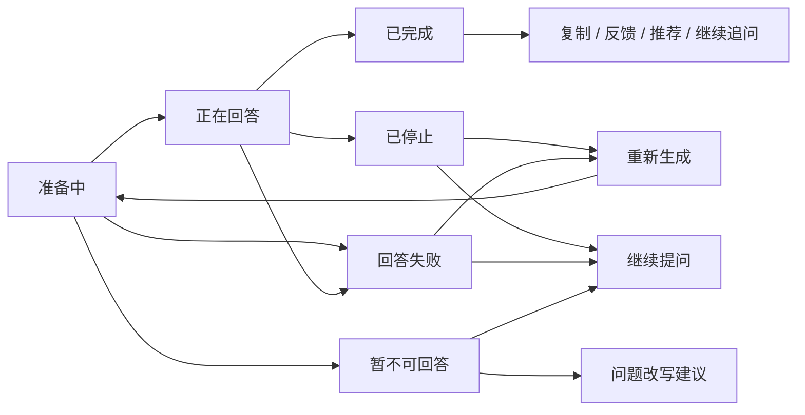

# sanye_anime 页面状态矩阵

| 项目 | 内容 |
| --- | --- |
| 文档版本 | v0.2 |
| 文档状态 | Baseline，客户端、官网与管理平台 P0 页面状态和跳转基线 |
| 关联任务 | PRE-TODO-002（补齐页面状态矩阵）、PRE-TODO-004（完成管理平台原型） |
| 关联文档 | [功能详细说明](./feature-specification.md)、[产品总体架构](./overall-architecture.md)、[页面原型](./prototypes/README.md)、[原型评审记录](../docs/prototype-review.md) |
| 适用范围 | `sanye_anime` 客户端、`official` 官网与 RuoYi 管理平台 P0 页面 |
| 更新时间 | 2026-08-18 |

## 1. 目的与使用方式

本文档为每个 P0 页面统一定义适用状态和状态跳转，确保产品定义不存在“只覆盖理想数据”的页面。原型中需要演示的状态同步到 `product/prototypes/`，正式前端实现时按本矩阵补齐全部适用状态。

使用规则：

1. 新增页面或功能必须先在本文档登记适用状态，再进入实现。
2. 矩阵与原型不一致时以矩阵为准，并回填原型。
3. P1/P2 页面在进入 P0 范围前，必须补齐对应状态定义。
4. 状态表现不允许互相混用，例如“系统繁忙”与“额度用尽”必须分开提示。

## 2. 统一状态定义

| 状态 | 定义 | 通用表现 |
| --- | --- | --- |
| 默认 | 数据正常，页面可完整使用 | 展示内容与操作入口 |
| 加载中 | 首次进入或数据刷新 | 骨架屏、轻量加载提示，不显示空白窗口 |
| 空数据 | 没有可展示的内容 | 说明原因 + 引导动作 |
| 失败 | 加载失败或操作失败 | 说明原因 + 重试入口，保留用户现场 |
| 离线 | 网络不可用 | 保留已加载内容 + 离线提示；恢复后重试或手动刷新 |
| 未登录/无权限 | 操作需要登录或角色权限 | 登录引导，登录后恢复原操作现场 |
| 提交中 | 操作正在处理 | 进度反馈 + 防重复提交 |
| 完成/成功 | 操作已生效 | Toast、按钮状态或页面内反馈 |
| 已停止（AI 专用） | 回答被用户主动停止 | 保留已生成内容 + 继续提问/重新生成 |
| 失败重试（AI 专用） | 回答失败 | 保留问题 + 重试，不新增第二条用户消息 |
| 额度用尽（AI 专用） | 体验次数用完 | 剩余状态 + 恢复时间 + 登录或稍后再试 |
| 下架/不可用（内容专用） | 内容已下架或不可查看 | 保留必要说明，隐藏失效操作 |
| 已删除/归档（会话专用） | 会话被删除或归档 | 删除需确认；归档可恢复；删除默认不可恢复 |

## 3. 通用状态跳转规则

1. 加载中 → 默认 / 空数据 / 失败 / 离线。
2. 失败 → 重试（回到加载中）或保留现场等待用户操作。
3. 离线 → 保留已加载内容；网络恢复后自动重试或由用户手动刷新。
4. 未登录/无权限 → 登录引导；登录返回后恢复草稿、输入内容和滚动位置。
5. 提交中 → 完成 / 失败；重复点击不产生第二次提交。
6. 空数据 → 引导动作（去发现、清除筛选、让 AI 帮我找、返回列表）。
7. 内容下架/不可用 → 保留说明，隐藏失效的观看、下载和跳转入口。
8. 所有操作反馈均可被再次触发，反馈不叠加或闪烁。

## 4. 客户端 P0 页面状态矩阵

| 页面 | 默认 | 加载中 | 空数据 | 失败 | 离线 | 未登录/无权限 | 提交中 | 完成/成功 | 特殊状态 | 原型演示 | 文档依据 |
| --- | --- | --- | --- | --- | --- | --- | --- | --- | --- | --- | --- |
| 客户端壳层（启动、左侧导航、顶部工具栏、用户区） | 进入首页，导航与工具栏可用 | 启动骨架，不显示空白窗口 | 不适用 | 首页错误态 + 重新加载；单内容区失败不阻塞窗口 | 公开内容可浏览，操作提示离线 | 未登录显示登录按钮；私密操作引导登录 | 不适用 | 登录/退出状态反馈 | 用户状态失效 → 重新登录提示 | 默认态与未登录入口已演示 | PC-001、PC-002、PC-003、PC-006、PC-008 |
| 首页（Banner、分类、分区、作品卡片、快捷入口） | 分类与内容分区正常展示 | 内容区骨架；图片占位不改变卡片尺寸 | 空分区隐藏，不显示空标题；Banner 无数据使用占位 | 分区失败独立重试；整体失败进入首页错误态 | 保留已加载内容 + 离线提示 | 可浏览公开内容；收藏引导登录 | 不适用 | 收藏成功 Toast / 按钮状态 | 图片失败占位；下架内容不显示失效入口 | 默认态、收藏完成态已演示 | HOME-001 至 HOME-008、PC-008 |
| 搜索结果页 | 结果列表 + 筛选 | 结果区骨架 | 无结果原因 + “让 AI 帮我找” | 保留搜索词 + 重试 | 离线提示 + 重试 | 可搜索；收藏引导登录 | 不适用 | 不适用 | 关键词过长提示修改 | 默认态、空数据、筛选交互已演示 | HOME-009 |
| 番剧仓库 | 全部作品 + 组合筛选 | 网格骨架 | 无结果原因 + 清除筛选 | 保留筛选条件 + 重试 | 离线提示 + 重试 | 可浏览；收藏引导登录 | 不适用 | 不适用 | 不适用 | 默认态、空数据已演示 | HOME-013 |
| 作品详情页 | 作品信息 + 收藏 + 问 AI + 相似作品 | 详情骨架 | 作品不存在/已删除 → 说明 + 返回 | 保留返回路径 + 重试 | 提示 + 保留已加载内容 | 公开信息可看；收藏引导登录 | 收藏操作中，防重复 | 收藏成功按钮状态；失败恢复旧状态 | 下架 → 保留说明，隐藏失效观看/跳转 | 默认态、收藏完成态已演示 | HOME-011、HOME-012、ACCOUNT-002 |
| AI 工作区 | AI 空状态或会话与消息 | 回答准备中（AI 头像 + 轻量加载） | 会话列表空：“还没有聊天记录”；无回答时展示 AI 空状态 | 回答失败 + 重试（不新增用户消息）；会话加载失败说明 + 返回列表 | 保留问题 + 提示重试 | 有限体验 + 登录引导 | 正在回答（显示停止按钮），发送防重复 | 回答完成显示复制/反馈/推荐；收藏完成 | 已停止保留内容；重新生成不新增问题；额度用尽提示；会话删除确认 | 空状态、生成中、停止、失败、重试、额度用尽已演示 | AI-002、AI-003、AI-006、AI-008 至 AI-010、AI-013、AI-014、AI-018、AI-022、AI-024、AI-025 |
| 我的工作区 | 资料 + 收藏 + 历史入口 + 设置/反馈入口 | 区块骨架 | 收藏空、历史空（带引导） | 区块失败重试；删除失败保留会话 | 提示；本地数据可看 | 未登录显示登录按钮与权益；收藏/云历史引导登录 | 删除/清理确认中 | 清空、删除结果反馈 | 注销处理中（P2）；下架收藏标记不可用 | 默认态、空收藏、空历史、清空记录已演示 | MINE-001、MINE-003、MINE-007、ACCOUNT-001 |

### 4.1 P1/P2 延后页面登记

以下页面不在本矩阵展开，进入 P0 范围前必须补齐状态定义：

- 设置页（MINE-006，P1）：主题、默认剧透模式、Enter 键发送、通知等。
- 浏览记录（MINE-004，P1）。
- 意见反馈（MINE-008，P1）。
- 退出登录（MINE-009，P1）。
- 最近访问（PC-005，P1）。
- 搜索历史和热门搜索（HOME-010，P1）。
- 复制回答与回答反馈（AI-016、AI-017，P1）。
- 会话归档与会话搜索（AI-021、AI-023，P1）。
- 账号注销（MINE-010，P2）。

## 5. 官网 P0 页面状态矩阵

官网页面以 [产品总体架构](./overall-architecture.md) 4.2 的 P0 模块为准，当前由静态原型覆盖默认态。

| 页面 | 默认 | 加载中 | 空数据 | 失败 | 离线 | 未登录/无权限 | 提交中 | 完成/成功 | 特殊状态 | 原型演示 | 文档依据 |
| --- | --- | --- | --- | --- | --- | --- | --- | --- | --- | --- | --- |
| 官网公开首页 | 产品定位、入口、公开精选 | 首屏骨架 | 公开精选为空时隐藏区块 | 区块失败重试或隐藏 | 页面提示 + 保留已加载内容 | 无需登录；进入客户端后按客户端规则 | 不适用 | 不适用 | 版本/下载状态提示 | 默认态、公开精选已演示 | 总体架构 4.2、4.3 |
| 官网产品介绍 | 客户端、AI 与使用场景介绍 | 内容骨架 | 文案缺失时隐藏区块 | 区块失败重试 | 页面提示 | 无需登录 | 不适用 | 不适用 | 不适用 | 默认态已演示 | 总体架构 4.2 |
| 官网下载/进入页 | 版本信息 + 客户端入口 | 下载信息骨架 | 不适用 | 下载信息加载失败重试 | 页面提示 | 无需登录 | 下载动作进行中（正式实现） | 下载完成提示（正式实现） | 安装包未发布 → 明确状态提示，不提供失效按钮 | 默认态、安装包未发布提示已演示 | 总体架构 4.2、4.4 |
| 官网法律与隐私 | 菜单 + 内容展示 | 内容骨架 | 不适用 | 内容加载失败重试 | 页面提示 | 无需登录 | 不适用 | 不适用 | 文案待法律审查时明确标注占位（GAP-013） | 默认态、四标签切换已演示 | 总体架构 4.2、GAP-013 |

## 6. 管理平台 P0 页面状态矩阵

管理平台页面以 [产品总体架构](./overall-architecture.md) 5.3 的 P0 模块和 [MVP 冻结清单](./mvp-freeze.md) 第 4 节为准，由静态原型覆盖可交互演示。

| 页面 | 默认 | 加载中 | 空数据 | 失败 | 离线 | 未登录/无权限 | 提交中 | 完成/成功 | 特殊状态 | 原型演示 | 文档依据 |
| --- | --- | --- | --- | --- | --- | --- | --- | --- | --- | --- | --- |
| 登录与权限 | 登录页 | 登录校验中（正式实现） | 不适用 | 登录失败提示（正式实现） | 离线提示（正式实现） | 未登录只能访问登录页 | 登录中，防重复 | 登录成功进入仪表盘 | 退出后回到登录页 | 登录、退出、角色切换已演示 | 总体架构 5.2、MVP 冻结 A-P0-01 |
| 仪表盘 | 指标、待办与最近动态 | 指标骨架 | 不适用 | 区块失败重试 | 保留已加载内容 | 需登录 | 不适用 | 不适用 | 待办可跳转对应模块 | 默认态、待办跳转已演示 | 总体架构 5.3 |
| 内容管理（列表） | 作品表格 + 状态标签 + 筛选 | 表格骨架 | 无结果 + 清除搜索 | 加载失败重试 | 离线提示 | 需登录；无权限角色隐藏新建入口 | 不适用 | 发布/下架/驳回结果反馈 | 草稿/待审核/已发布/已下架状态 | 默认、空数据、状态切换、权限隐藏已演示 | 总体架构 5.3、MVP 冻结 A-P0-03 |
| 内容表单 | 新建/编辑表单 | 保存中（按钮禁用） | 不适用 | 标题缺失校验提示 | 离线提示 | 无权限角色不显示入口 | 保存中 | 保存草稿成功回到列表 | 提交审核后进入待审核 | 提交中、校验失败、完成已演示 | MVP 冻结 A-P0-03 |
| 内容详情 | 作品信息、来源与审核记录 | 详情骨架 | 作品不存在 → 返回列表 | 加载失败重试 | 离线提示 | 按角色显示/隐藏操作 | 审核操作中 | 审核通过/驳回/下架反馈 | 操作历史记录 | 详情、审核操作已演示 | MVP 冻结 A-P0-03 |
| 用户反馈 | 列表 + 状态筛选 | 列表骨架 | 状态标签下无数据 | 加载失败重试 | 离线提示 | 需登录 | 状态更新中 | 状态推进结果反馈 | 高优先级标记 | 默认、详情、状态推进、空数据已演示 | 总体架构 5.3、MVP 冻结 A-P0-04 |
| 用户管理 | 用户列表 + 角色标签 | 列表骨架 | 不适用 | 加载失败重试 | 离线提示 | 只读角色操作按钮禁用 | 启停处理中 | 启停结果反馈 | 角色标签区分 | 默认、无权限禁用已演示 | MVP 冻结 A-P0-05 |
| 任务管理 | 任务列表 + 状态汇总 | 运行中状态 | 不适用 | 失败 + 重试入口 | 离线提示 | 需登录 | 执行中防重复 | 执行成功反馈 | 重试中状态 | 默认、运行中、失败、重试已演示 | MVP 冻结 A-P0-07 |
| 权限与审计 | 角色说明 + 审计记录 | 列表骨架 | 无审计记录 | 加载失败重试 | 离线提示 | 仅授权角色可查看 | 不适用 | 操作写入审计 | 菜单与按钮随角色可见性变化 | 角色切换、菜单可见性、审计记录已演示 | 总体架构 5.3、MVP 冻结 A-P0-06 |

## 7. AI 回答过程状态机

状态规则：

1. 准备中：AI 头像和轻量加载状态，不展示空白气泡。
2. 正在回答：文字逐步出现，显示停止按钮；发送按钮防重复。
3. 已停止：保留已经生成的内容，提供继续提问和重新生成。
4. 回答失败：保留用户问题，提供重试；重试不产生第二条相同用户消息。
5. 重新生成：使用原问题，不新增用户消息；连续失败时提示稍后再试。
6. 已完成：显示复制、反馈和推荐作品卡片，可继续追问。
7. 暂不可回答：友好说明 + 问题改写建议。
8. 额度用尽：展示剩余状态和恢复时间，提供登录或稍后再试；“系统繁忙”与“额度用尽”分别提示。

## 8. 原型同步清单

### 8.1 已在原型中演示

- 客户端：首页、搜索、仓库、详情、AI、我的各页默认态；搜索与仓库空数据；我的空收藏/空历史与清空记录；详情收藏完成态；AI 空状态、回答准备中、生成中、停止、失败、重试与额度提示；官网公开首页、下载未发布提示、法律四标签切换。
- 管理平台：登录/退出、角色切换与菜单可见性、内容管理闭环（新建→保存草稿→提交审核→审核通过发布→客户端仓库可见）、反馈详情与状态推进、任务立即执行与重试、审计记录、空数据、提交中、无权限禁用等状态。

### 8.2 尚未在原型演示、正式实现时必须覆盖

- 加载骨架：首页、搜索、仓库、详情、我的各区块。
- 失败与重试：首页分区、搜索、仓库、详情。
- 离线提示与恢复。
- 未登录引导（登录窗口与登录返回恢复现场）。
- AI 会话列表空状态、会话删除/归档、会话加载失败。
- 内容下架与不可用标记。
- 官网首屏骨架与区块失败。
- 管理平台：真实登录校验、加载骨架、失败重试、离线与审计的持久化（由 `sanye_admin_server` 真实运行验收覆盖）。

## 9. PRE-TODO-002 与 PRE-TODO-004 验收标准

1. 客户端与官网每个 P0 页面都在本文档中登记适用状态，不存在“只覆盖理想数据”的页面定义。
2. 通用状态跳转规则和 AI 回答过程状态机明确（第 3、7 节）。
3. AI 回答过程状态机已同步到原型（停止、失败、重试可演示）。
4. 管理平台 P0 页面状态矩阵已建立（第 6 节），原型可走通内容维护、反馈处理、任务执行、角色权限与审计的运营主流程。
